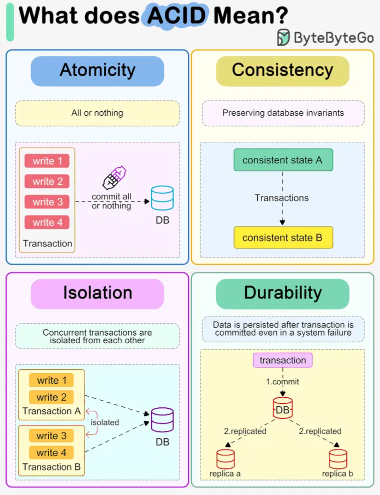

## ACID PROPERTIES
ACID is a set of properties that ensure reliable transactions in a database system. It stands for Atomicity, Consistency, Isolation, and Durability. These properties ensure that database transactions are processed reliably and help in maintaining the integrity of data across concurrent transactions.

## ATOMICITY
Atomicity guarantees that each transaction is treated as a single unit, which either succeeds completely or fails completely. There is no in-between state. If any part of a transaction fails, the database rolls back to its previous state, as if the transaction had never happened.

## CONSISTENCY
Consistency ensures that a transaction can only bring the database from one valid state to another. This maintains the data integrity by ensuring that any transaction will only be committed if it respects all database rules, including constraints, cascades, and triggers.

## ISOLATION
Consistency ensures that a transaction can only bring the database from one valid state to another. This maintains the data integrity by ensuring that any transaction will only be committed if it respects all database rules, including constraints, cascades, and triggers.

## DURABILITY
Durability ensures that once a transaction has been committed, it will remain so, even in the event of power loss, crashes, or errors. In PostgreSQL, this is managed through the use of write-ahead logging (WAL), which records changes before they are applied to the database.

